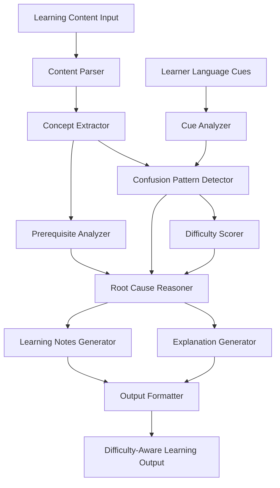

# 🧠 Confusion-Aware AI Insight Engine

  
  
  
  
  

  <h2>📚 AI-Powered Learning Confusion Detection & Explanation Engine</h2>
  
<em>Helping learners understand not just <b>what</b> is difficult — but <b>why</b></em>

---

## 🌟 Overview

**Confusion-Aware AI Insight Engine** is an intelligent educational AI system designed to **identify, analyze, and resolve learner confusion** in educational content.

Instead of treating all topics equally, the system focuses on **high-confusion, high-impact concepts** by combining:

* 📘 Content understanding
* 🗣️ Learner language cues
* 🧠 AI-based reasoning
* 🎯 Difficulty-aware explanation generation

This approach makes learning **more inclusive, efficient, and scalable**, especially for **diverse learner populations in Bharat**.

---

## 🎯 Mission Statement

> *To reduce learning failure caused by hidden confusion by using AI to detect difficult concepts, explain root causes, and guide learners with clarity-focused study material.*

---

## ❗ Problem Statement

In India’s large-scale education ecosystem:

* Students struggle silently due to **missing prerequisites**
* Confusion is often mistaken as “lack of effort”
* Existing AI tools only **summarize**, not **reason**
* Teachers cannot scale personalized attention

### Current systems fail because they:

❌ Do not understand learner confusion
❌ Ignore why a concept feels difficult
❌ Provide one-size-fits-all explanations

---

## 💡 Our Solution

The **Confusion-Aware AI Insight Engine** introduces a **confusion-first learning paradigm**.

### 🔍 What the system does:

* Detects **confusing concepts** inside learning material
* Analyzes **learner language cues** (questions, doubts, feedback)
* Assigns **difficulty scores (0–100)**
* Identifies **missing prerequisites & misconceptions**
* Generates **targeted explanations**
* Produces **structured learning notes prioritized by difficulty**

> The system doesn’t ask *“What should be learned?”*
> It asks 👉 *“What is blocking understanding?”*

---

## 🏗️ System Architecture

---

## 🧠 Core AI Components

### 🧩 Content Parser

* Extracts structured learning content
* Preserves headings, flow, and emphasis
* Validates content quality

### 🔍 Concept Extractor

* Identifies key concepts
* Builds relationships between concepts
* Detects abstraction and complexity levels

### 🗣️ Learner Cue Analyzer

* Analyzes learner questions & feedback
* Detects confusion markers and uncertainty
* Assigns confidence scores to confusion signals

### 🚨 Confusion Pattern Detector

* Aggregates confusion across learners
* Identifies frequently misunderstood concepts
* Tracks temporal confusion trends

### 📊 Difficulty Scorer

* Scores each concept on a **0–100 difficulty scale**
* Factors in:

  * Linguistic complexity
  * Prerequisite depth
  * Confusion frequency

### 🧠 Root Cause Reasoner

* Determines *why* confusion exists
* Distinguishes between:

  * Concept complexity
  * Missing prerequisite
  * Misconception
  * Poor explanation

### ✨ Explanation Generator

* Generates **targeted explanations**
* Uses analogies, step-by-step logic, and examples
* Adapts explanation depth to difficulty level

### 📘 Learning Notes Generator

* Produces structured study notes
* Prioritizes high-difficulty concepts
* Highlights common mistakes & applications

---

## ✨ Key Features

### 🧠 Confusion-First AI Reasoning

> AI focuses on learning blockers, not just content coverage

* Identifies **why learners struggle**
* Explains confusion instead of masking it

---

### 📊 Difficulty-Aware Learning Notes

> Learn what matters most, first

* Concepts ranked by difficulty
* Study recommendations included
* Dependencies clearly shown

---

### 🎯 Targeted Explanation Generation

> One concept, multiple explanation styles

* Step-by-step explanations
* Analogy-based simplifications
* Misconception correction

---

### 📈 Scalable for Bharat

> Designed for large, diverse learner bases

* Works with minimal learner input
* Language-agnostic architecture
* Suitable for EdTech & government platforms

---

## 🇮🇳 AI for Bharat Impact

This system is highly aligned with **AI for Bharat** goals:

* 📚 Improves conceptual clarity in education
* 🧑‍🏫 Reduces teacher workload
* 🌍 Supports diverse learner backgrounds
* 🎓 Helps competitive exam aspirants
* 🏫 Scales across public education systems

---

## 🛠️ Technology Stack (Conceptual)

| Layer       | Technologies                        |
| ----------- | ----------------------------------- |
| 🧠 AI/NLP   | NLP Pipelines, Reasoning Models     |
| 📊 Analysis | Knowledge Graphs, Pattern Detection |
| 🧩 Logic    | Rule + Reasoning Hybrid AI          |
| 📘 Output   | Structured Learning Notes           |
| ☁️ Design   | Modular & Scalable Architecture     |

---

## 🧪 Evaluation Strategy

* Expert comparison for difficult concepts
* Synthetic learner confusion simulation
* Explanation relevance validation
* Difficulty score consistency checks

---

## 🚀 Future Scope

* Indian language support
* LMS & EdTech integration
* Personalized learner profiles
* Confusion heatmaps for teachers
* Adaptive learning paths

---

## 🏁 Conclusion

The **Confusion-Aware AI Insight Engine** shifts education AI from **content delivery** to **conceptual clarity**.

By identifying **where learners struggle**, **why they struggle**, and **how to fix it**, this system represents a **next-generation learning assistant** built for **Bharat-scale education**.

> **AI should not just teach — it should remove confusion.**

---

  <h3>🌟 Built with ❤️ for learners across Bharat 🌟</h3>
  
<strong>Confusion-Aware AI — Learning with Clarity</strong>

