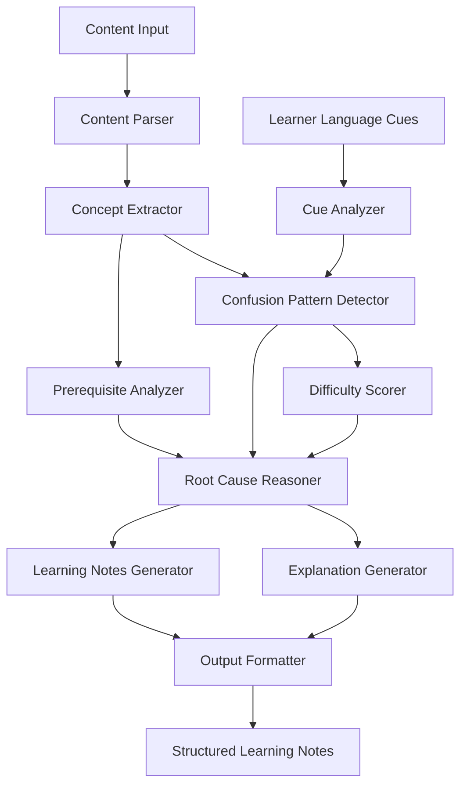

# Design Document: Confusion-Aware AI Insight Engine

## Overview

The Confusion-Aware AI Insight Engine is an intelligent system that analyzes educational content to identify confusion patterns and generate difficulty-aware learning materials. The system leverages natural language processing, machine learning, and knowledge graph techniques to understand concept relationships, detect learning difficulties, and provide targeted explanations.

Unlike traditional linear summarization tools, this system prioritizes concepts based on inferred learning difficulty and provides explanations that address root causes of confusion. The system combines content analysis with learner language cue detection to create a comprehensive understanding of where learners struggle and why.

## Architecture

The system follows a modular architecture with clear separation between analysis, reasoning, and generation components:



The architecture consists of three main processing layers:

1. **Analysis Layer**: Parses content and extracts concepts, analyzes learner cues
2. **Reasoning Layer**: Detects confusion patterns, scores difficulty, identifies prerequisites
3. **Generation Layer**: Creates targeted explanations and structured learning notes

## Components and Interfaces

### Content Parser
**Purpose**: Processes various input formats and extracts structured content
**Input**: Raw learning content (text, documents)
**Output**: Structured content with preserved formatting and metadata
**Key Functions**:
- Text extraction and cleaning
- Structure preservation (headings, lists, emphasis)
- Content validation and quality assessment

### Concept Extractor
**Purpose**: Identifies key concepts and their relationships within content
**Input**: Structured content from Content Parser
**Output**: List of concepts with metadata (complexity indicators, relationships)
**Key Functions**:
- Named entity recognition for domain-specific terms
- Concept boundary detection
- Relationship mapping between concepts

### Cue Analyzer
**Purpose**: Processes learner language cues to identify confusion indicators
**Input**: Learner communications, questions, feedback
**Output**: Confusion signals with confidence scores
**Key Functions**:
- Linguistic pattern recognition for confusion markers
- Sentiment analysis for frustration detection
- Question classification for knowledge gap identification

### Confusion Pattern Detector
**Purpose**: Combines content analysis with learner cues to identify difficult concepts
**Input**: Concepts from extractor, confusion signals from cue analyzer
**Output**: Confusion patterns with associated concepts
**Key Functions**:
- Pattern aggregation across multiple learners
- Confidence scoring for confusion detection
- Temporal pattern analysis

### Difficulty Scorer
**Purpose**: Assigns numerical difficulty scores to concepts
**Input**: Concepts with confusion patterns
**Output**: Concepts with difficulty scores (0-100 scale)
**Key Functions**:
- Multi-factor difficulty assessment (linguistic complexity, prerequisite depth, confusion frequency)
- Normalization across different content types
- Calibration based on learner feedback

### Prerequisite Analyzer
**Purpose**: Identifies prerequisite knowledge relationships between concepts
**Input**: Extracted concepts and their relationships
**Output**: Prerequisite dependency graph
**Key Functions**:
- Knowledge graph construction
- Dependency chain analysis
- Missing prerequisite detection

### Root Cause Reasoner
**Purpose**: Determines why concepts are difficult and what causes confusion
**Input**: Difficulty scores, prerequisite relationships, confusion patterns
**Output**: Root cause analysis for each difficult concept
**Key Functions**:
- Causal inference for confusion sources
- Misconception identification
- Knowledge gap analysis

### Explanation Generator
**Purpose**: Creates targeted explanations that address specific confusion sources
**Input**: Root cause analysis, concept definitions
**Output**: Simplified explanations with multiple approaches
**Key Functions**:
- Adaptive explanation generation based on difficulty level
- Analogy and example generation
- Misconception correction

### Learning Notes Generator
**Purpose**: Creates structured, prioritized learning materials
**Input**: All analysis results, explanations
**Output**: Formatted learning notes with prioritization
**Key Functions**:
- Content prioritization by difficulty
- Study recommendation generation
- Progress tracking integration

### Output Formatter
**Purpose**: Formats all outputs for optimal readability and usability
**Input**: Generated explanations and learning notes
**Output**: Well-formatted, structured learning materials
**Key Functions**:
- Hierarchical formatting
- Visual difficulty indicators
- Multi-format output support

## Data Models

### Concept Model
```
Concept {
  id: string
  name: string
  definition: string
  difficulty_score: number (0-100)
  complexity_indicators: {
    linguistic_complexity: number
    prerequisite_depth: number
    abstraction_level: number
  }
  relationships: ConceptRelationship[]
  confusion_patterns: ConfusionPattern[]
}
```

### ConfusionPattern Model
```
ConfusionPattern {
  id: string
  concept_id: string
  confusion_type: enum (prerequisite_gap, misconception, complexity, context)
  confidence_score: number (0-1)
  evidence: {
    learner_cues: string[]
    linguistic_markers: string[]
    frequency: number
  }
  root_causes: string[]
}
```

### ConceptRelationship Model
```
ConceptRelationship {
  source_concept_id: string
  target_concept_id: string
  relationship_type: enum (prerequisite, related, part_of, example_of)
  strength: number (0-1)
  evidence_score: number (0-1)
}
```

### LearningNote Model
```
LearningNote {
  id: string
  title: string
  priority_score: number (0-100)
  concepts: Concept[]
  explanations: TargetedExplanation[]
  study_recommendations: StudyRecommendation[]
  common_mistakes: string[]
  practical_applications: string[]
}
```

### TargetedExplanation Model
```
TargetedExplanation {
  id: string
  concept_id: string
  explanation_text: string
  approach_type: enum (analogy, example, step_by_step, visual)
  addresses_confusion: ConfusionPattern[]
  prerequisite_explanations: TargetedExplanation[]
  difficulty_level: enum (beginner, intermediate, advanced)
}
```

## Validation and Evaluation Approach

The system will be evaluated through scenario-based testing using sample educational content and synthetic learner language cues:

### Evaluation Methodology
- **Sample Content Testing**: Use diverse educational materials (textbooks, articles, course materials) to validate concept extraction and difficulty scoring
- **Synthetic Learner Cues**: Generate realistic confusion indicators (questions, feedback, linguistic patterns) to test cue integration
- **Comparative Analysis**: Compare system outputs with expert-identified difficult concepts and explanations
- **User Feedback Integration**: Collect feedback on explanation quality and learning note usefulness

### Success Metrics
- **Concept Identification Accuracy**: Percentage of correctly identified difficult concepts
- **Explanation Relevance**: Quality assessment of generated explanations addressing confusion sources
- **Learning Note Utility**: User satisfaction with prioritized, structured learning materials
- **AI Reasoning Demonstration**: Evidence that system decisions go beyond simple rule-based logic

## Error Handling and System Constraints

The system handles incomplete input and resource limitations through graceful degradation:

### Input Handling
- **Insufficient Content**: Provide feedback about minimum content requirements and analysis limitations
- **Format Issues**: Support common text formats with clear error messages for unsupported types
- **Missing Context**: Continue analysis with available information, clearly indicating limitations

### System Constraints
- **Core Functionality Priority**: When resources are limited, prioritize concept extraction and basic difficulty scoring over advanced features
- **Progressive Analysis**: Implement analysis in stages, allowing partial results when full processing isn't possible
- **Graceful Degradation**: Reduce analysis depth rather than failing completely when constraints are encountered